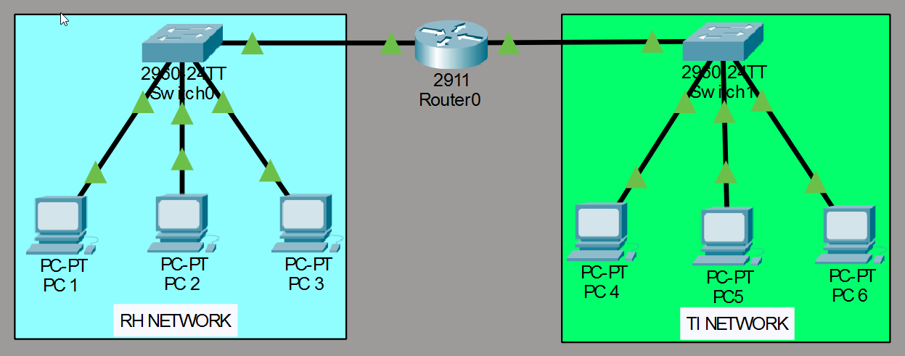
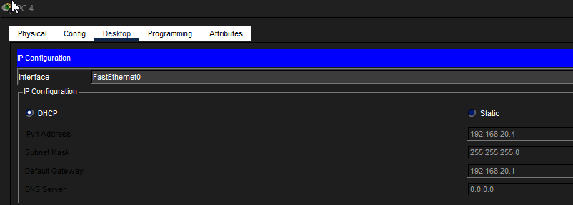

# DHCP-Network-Simulator
This project demonstrates how a network operates using the DHCP protocol, based on a simulated lab environment in Cisco Packet Tracer.

Objective: To analyze how a LAN uses the DHCP protocol and 


to detail its settings and explain why it is used.

```
Requirements: 
- Correct logical cabling
- Functional physical signal
- Devices such as: PC, printer, or telephone
- Layer 2 (link) device: switch 
- Layer 3 (network) device: router
- VLANs (depending on network size and preference – optional)

VLAN = Logical network segment used to separate networks
```

Logical topology


As shown, I used two networks for the lab simulation: one consisting of static IPs and another using dynamic IPs (DHCP)

Network 1 (RH NETWORK) Department 10
using static IPs

Network 2 (TI NETWORK) Department 20
using dynamic IPs

Each network has 3 PCs (hosts) to perform the simulation. I added 1 switch to each network and 1 router to handle routing between VLANs.

```
Switch 1 Configuration:

VLAN 10
name RH
interface fa0/1-3
switchport mode access
switchport access VLAN 10

interface fa0/4
switchport mode trunk
```

```
Switch 2 Configuration:

VLAN 20
name TI
interface fa0/1-3
switchport mode access
switchport access VLAN 20

interface fa0/4
switchport mode trunk
```

```
Router Configuration:

int g0/0.10
encapsulation dot1Q 10
ip addr 192.168.10.1 255.255.255.0
(Configuration for Department 10)

(Configuration for Department 20)
int g0/1.20
encapsulation dot1Q 20
ip addr 192.168.20.1 255.255.255.0

ip dchp pool VLAN20
network 192.168.20.0 255.255.255.0
default-gateway 192.168.20.1
dns-server 8.8.8.8
```

Why use DHCP?

- IP automation: You don’t need to configure everything manually; DHCP automatically assigns an IPv4 address (the host’s logical identifier) as well as the subnet mask, gateway, and DNS.

- Time savings + configuration automation.


Configuration results:
 [Result](05-IPConfiguration-02.png)

Conclusion:


A simulated lab was created in Cisco Packet Tracer to model a network using the DHCP protocol. The primary goal was to automate IP address assignment in a secure and reliable manner, ensuring that network users can automatically obtain an IPv4 address, subnet mask, gateway, and DNS server.


Author: Eduardo Almeida
Project date: March 15, 2026


